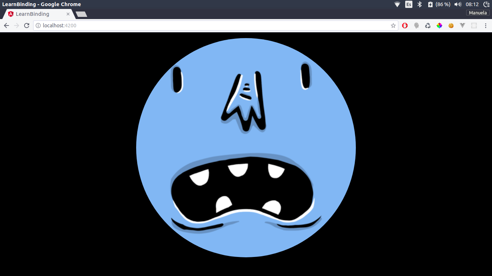

# Aprendamos Binding en Angular :hatching_chick:

## 4. Agreguemos una nueva imagen :camera:
- Borra el contenido del archivo app.component.html y en su lugar crea una etiqueta `` que obtenga la imagen de la siguiente ruta: https://api.adorable.io/avatars/500/300@adorable.io.png
 
[Adorable Faces](http://avatars.adorable.io/) es un API que nos provee tiernas imagenes para usar como placeholder. La ruta de la imagen se forma de la siguiente forma:
[https://api.adorable.io/avatars/Tamaño_de_la_imagen/numero_de_la_imagen@adorable.io.png](https://api.adorable.io/avatars/500/300@adorable.io.png)

## 5. Ahora, un poco de estilo :nail_care:
- En el archivo app.component.css agregaremos la clase 'random-face'
```css
.random-face {
  height: 90vh;
  margin: 1rem;
  border-radius: 50%;
}
```

- Para aplicarle el estilo a nuestra imagen, agregaremos la clase '.random-face' a la etiqueta `` creada anteriormente

- El archivo styles.css contiene los estilos globales de nuestra app, a este le vamos a añadir las siguientes lineas 
```css
body {
  background-color: black;
  margin: 0;
  text-align: center;
}
```

Ahora puedes ir a tu navegador y ver el resultado :tada: :tada: :tada:




## Ahora puedes ir al [Branch #2](https://github.com/angular-medellin/learn-more/tree/2)


